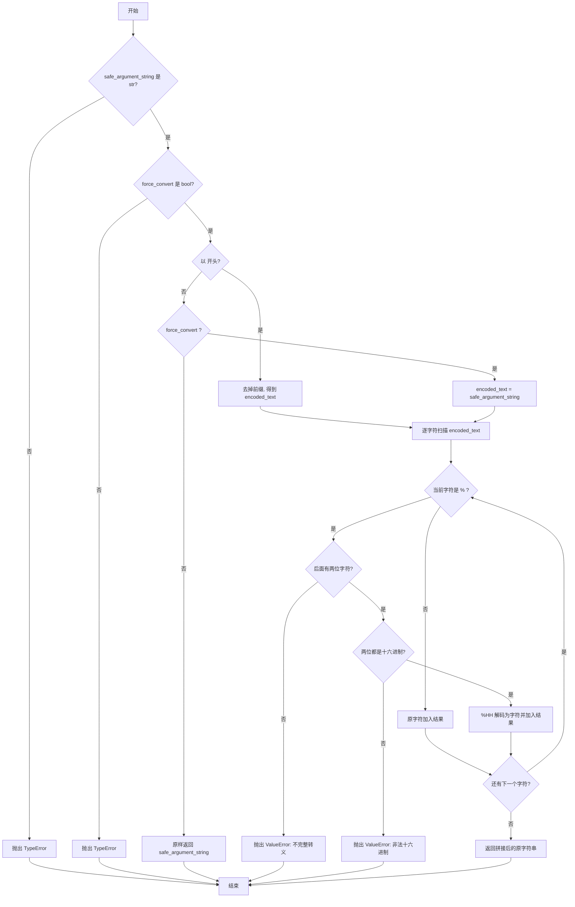

# 任务原始提示词

我需要设计一对安全字符串的转换函数，可以将字符串中的特殊字符替换为HEXCODE, 作为安全字符串，在应用中使用；并提供安全字符串转换回普通字符串的功能。

请帮我设计这个转换算法，我希望它高效、且考虑全面，能够对所有的字符串转换都支持，尤其是 corner case 的支持。

我希望你生成 python 的代码和测试代码，并将本提示词和设计思路、考虑的corner case 等详细思路文档，都记录下来。 所有的文件放置到根目录下一个合适名称的文件夹

---

# 设计目标

1. **可逆**：任意输入字符串都能 100% 恢复。
2. **安全**：与 CSM 参数关键字规则保持一致，避免消息解析冲突。
3. **高效**：单次线性扫描，时间复杂度 O(n)。
4. **全面**：覆盖 CSM 关键字字符、控制字符、Unicode、非法输入等边界场景。

# 编码算法

## 0) 与 CSM-Wiki VI 名称/参数对齐

- `CSM - Make String Arguments Safe.vi`
  - `Argument String`
  - `Ignore Argument Type(F)`
  - `Safe Argument String`
- `CSM - Revert Arguments-Safe String.vi`
  - `Safe Argument String`
  - `Force Convert (F)`
  - `Origin Argument String`

Python 实现提供同语义接口：

- `make_string_arguments_safe(argument_string, ignore_argument_type=False)`
- `revert_arguments_safe_string(safe_argument_string, force_convert=False)`

## 1) 关键字来源

根据 `CSM -- Revert Arguments Safe StringVI` 的关键字说明，涉及关键模式：

- `->`
- `->|`
- `-@`
- `-&`
- `<-`
- `\r`
- `\n`
- `//`
- `>>`
- `>>>`
- `;`
- `,`

因此，参与关键字的字符集合为：`-|@&<>\r\n/;,`。

## 2) 输入层

输入为 Python `str`，按字符线性扫描。

## 3) 输出字符策略

- 若字符属于关键字字符集合 `-|@&<>\r\n/;,`，转义为 `%HH`（两位十六进制，大写）
- `%` 本身也转义为 `%25`，保证解码无歧义
- 其他字符直接输出（包括普通文本和 Unicode）
- 这里采用**按字符保守转义**（不是按完整 token 匹配）：只要字符属于集合就转义，不依赖上下文

例如：
- `->` -> `%2D%3E`
- `>` -> `%3E`（即使单独出现也会转义）
- `;` -> `%3B`
- `,` -> `%2C`
- `%` -> `%25`

## 4) 解码策略

按字符线性扫描：
- 若遇到 `%`，必须紧跟两位十六进制，转为对应字符
- 若不是 `%`，直接输出原字符
- 不完整 `%` 转义、非法十六进制，抛出 `ValueError`

## 5) 两个函数流程图

### `make_string_arguments_safe(argument_string, ignore_argument_type=False)`

```mermaid
flowchart TD
    A[开始] --> B{argument_string 是 str?}
    B -- 否 --> E1[抛出 TypeError] --> Z[结束]
    B -- 是 --> C{ignore_argument_type 是 bool?}
    C -- 否 --> E2[抛出 TypeError] --> Z
    C -- 是 --> D[逐字符扫描 argument_string]
    D --> F{字符在 -|@&<>\\r\\n/;, 或 % ?}
    F -- 是 --> G[输出 %HH 大写十六进制]
    F -- 否 --> H[原字符输出]
    G --> I{还有下一个字符?}
    H --> I
    I -- 是 --> F
    I -- 否 --> J[拼接 safe_argument_string]
    J --> K{ignore_argument_type ?}
    K -- 是 --> L[返回 safe_argument_string] --> Z
    K -- 否 --> M[返回 <SAFESTR> + safe_argument_string] --> Z
```

### `revert_arguments_safe_string(safe_argument_string, force_convert=False)`



# 为什么该方案无歧义

- `%` 作为唯一转义前缀，固定长度 3（`%HH`）。
- `%` 本身会被编码为 `%25`，不会与原文冲突。
- 解码器可严格校验格式，避免 silent corruption。

# 复杂度与效率

- 编码：单次遍历字符，O(n)
- 解码：单次遍历字符，O(n)
- 仅使用轻量字符串拼接列表，内存开销可控

# 覆盖的 corner cases

1. 空字符串
2. 普通 ASCII 文本（不应被改写）
3. CSM 关键字字符与组合（`->`、`//`、`>>>`、`;`、`,` 等）
4. 转义前缀字符 `%` 本身
5. 控制字符：`\r`、`\n` 以及其他非关键控制字符（如 `\t`、`\x00`）
6. Unicode：中文、emoji
7. 超长混合字符串
8. ASCII 全量 roundtrip（0x00-0x7F）
9. 非法输入处理：不完整转义、非十六进制
10. 入参类型错误（非 `str`）

# 代码与测试文件

- `safe_string_codec/safe_string_codec.py`：核心编码/解码实现
- `safe_string_codec/test_safe_string_codec.py`：`unittest` 全面测试
- `safe_string_codec/__init__.py`：对外导出接口
